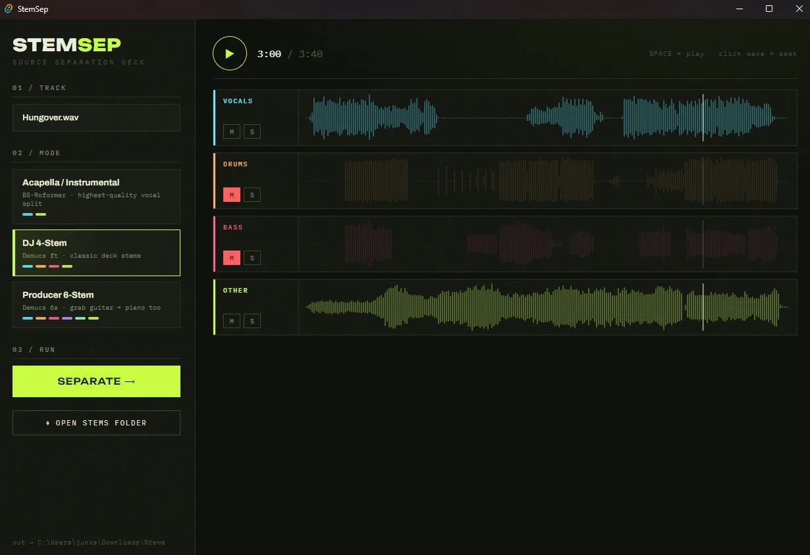
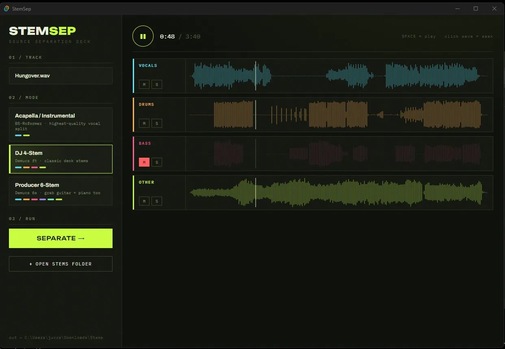

<div align="center">

# StemSep

**GPU-accelerated stem separation deck for DJs.**
Drop a track → pull acapellas, drums, bass & synths as DAW-ready WAVs.
Built for AMD GPUs on Windows — ROCm-accelerated PyTorch, no CUDA required.

<p>
  
  
</p>

</div>

## Why

Ultimate Vocal Remover and friends leave Radeon owners on CPU or flaky DirectML. StemSep runs the same model families — **BS-Roformer** and **Demucs** — on AMD's official ROCm-on-Windows PyTorch wheels. A 4-stem fine-tuned Demucs pass on an RX 9070 XT takes ~75 seconds; the same job on CPU takes 12–20 minutes.

## Modes

| Preset | Model | Stems |
|---|---|---|
| Acapella / Instrumental | BS-Roformer ViperX 1297 | Vocals, Instrumental |
| DJ 4-Stem | Demucs htdemucs_ft | Vocals, Drums, Bass, Other |
| Producer 6-Stem | Demucs htdemucs_6s | Vocals, Drums, Bass, Guitar, Piano, Other |

Synths/pads land in **Other** on the Demucs presets. The Roformer 2-stem beats Demucs (and UVR's defaults) for clean acapellas.

After a run you get a synced multi-waveform rack: space-bar transport, click-to-seek across all stems, per-stem solo/mute — audition the split before you commit it to a deck or a project.

## Requirements

- Windows 11, AMD RX 9000 / RX 7900-series GPU (ROCm-on-Windows supported)
- AMD Adrenalin driver **26.2.2+** (older drivers → falls back to CPU, much slower)
- [uv](https://docs.astral.sh/uv/) + Python 3.12, Node 20+, Rust toolchain

## Setup

```powershell
npm install
uv sync --project python   # ~2 GB: ROCm PyTorch + audio-separator
npm run tauri dev          # dev mode
npm run tauri build        # installer
```

First separation per model downloads the model checkpoint (~100–700 MB) into the audio-separator cache.

## Output

Stems land next to the source track — drag straight into rekordbox or Ableton:

```
<track folder>\Stems\<track name>\<preset>\<track name> - Vocals.wav
```

## Architecture

- **Tauri 2 + React 19** UI (`src/`): drop zone, preset cards, synced multi-waveform stem rack (wavesurfer.js), solo/mute, space-bar transport.
- **Rust** (`src-tauri/`): spawns the Python sidecar via `uv run`, streams JSON-lines progress as Tauri events, kill-on-abort.
- **Python sidecar** (`python/separate.py`): [audio-separator](https://github.com/nomadkaraoke/python-audio-separator) with ROCm torch pinned by direct wheel URLs in `pyproject.toml` (so a stray `pip install` can't silently swap in CPU torch — a known ROCm-on-Windows footgun). AMD's torch wheel requires `rocm[libraries]`, which only exists as an sdist in AMD's wheel directory — a uv dependency override redirects the requirement there.
